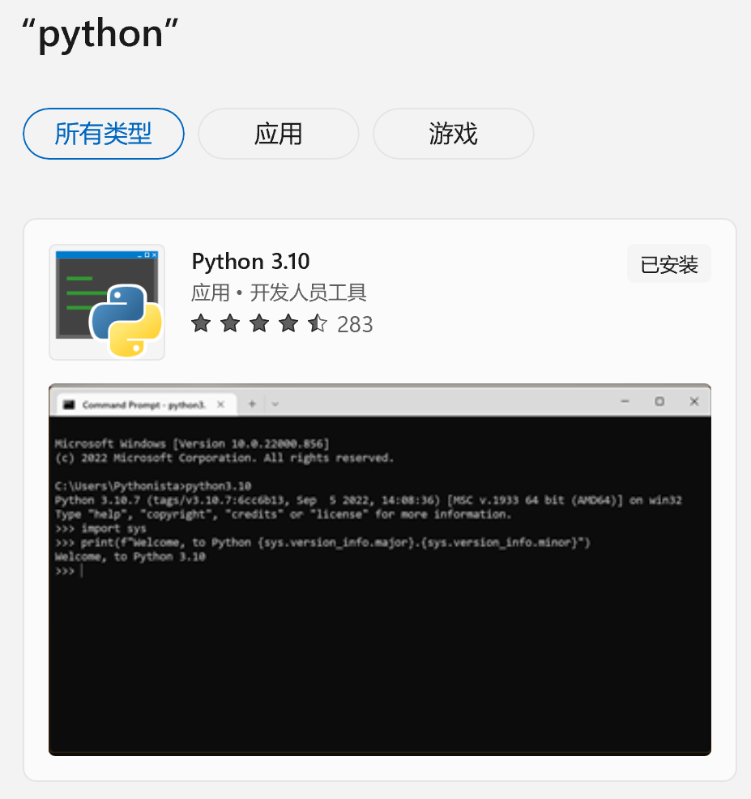

# 汉王N10摘抄笔记处理

## 汉王N10笔记功能的特色

当使用汉王N10读书的时候，我们的笔记被分成了三部分：

1. 摘抄文件，这里面有原始的摘抄，也有打开摘抄文件后自已写的想法等
2. 截图，截图有三个来源：
    1. 屏幕截图
    2. 阅读pdf时，使用“提取”中的“区域截图”生成的图片文件
    3. 手写笔记导出为图片
3. 手写笔记OCR识别为文本，你可能不喜欢打开摘抄文件写字，更喜欢手写想法

汉王N10摘抄很有特点：

* 汉王N10可以**随时随地**地打开摘抄文件进行编辑，在里面加入自已的**想法**，或进行**初步整理**
* 其他家的阅读器都是: 1)先“标注+高亮”，2)然后导出标注到文件

很明显，汉王N10的摘抄更加的自由，缺点就是不像其他家那样在原件中留下痕迹，比如高亮文本，标注泡泡等

但如果你像我一样不喜欢在书上写写画画，那么这个缺点也就不是缺点了，书上写写画画的东西只有再次看书的时候才能看到，不是有效的读书形式。最重要的依然是导出的摘抄文件。

汉王N10也能手写笔记，但因为摘抄功能实在太好用了，读书时基本用不到手写笔记

## 汉王N10笔记功能的痛点

### 痛点1：摘抄内容越积越多时，打开摘抄文件，没有自动定位到文件最后，不方便编辑

这个痛点可以通过安装百度输入法或是搜狗输入法解决，建议使用百度输入法，搜狗输入法有点小小的不方便

安装百度输入法后，你会在键盘上方的工具栏里看到一个`<I>`这样的工具按钮，点进去，里面有跳到文件开始和结尾的按钮

### 痛点2：摘抄出来的文本乱糟糟的

N10的一次“摘抄”得到的内容是下面这样的  （注：其中的"**"是我加的markdown标志)

```txt
2022年09月05日 22:15:31  摘自<<心理学与生活 - 19th - 理查德·格里格-人民邮电出版社 (2014).pdf>> 第42页
当**铁钦纳**把冯特的心理学带回美国时,他提倡用 
这种科学方法来研究意识。他用于检查意识的心理活 
动元素的方法是**内省法(introspection)**,即由个体系 
统地检查自己有关特定感官经验的思维和感受 铁钦 
纳强调**“什么”是心理的内容**，而非“为什么”和“怎 
么”思考。他的观点以**结构主义(structuralism)**之名 
著称于世.即对心理和行为的结构的研究：
```

这一段内容以下问题：

1. 那一段带有年月日时间的“抬头行”对笔记的完整性来说是非常有必要的的，里面记录了详细的“上下文”信息。但在整理完后的笔记里“抬头行”肯定是要删掉的
2. 文本换行的问题： 这是所有pdf摘抄都存在的问题，不光是汉王N10

在摘抄英文的时候，可能还会出现别的问题：

```txt
2022年09月11日 15:10:16  摘自<<Introduction to Psychology_ Gateways to Mind and Behavior - 13th - Dennis Coon, John O. Mitterer-Wadsworth Cengage Learning (2012).pdf>> 第63页
The biological perspective    seeks to explain our behavior in terms 
of  biological    principles    such  as  brain  processes,  evolution,and 
genetics.
```

不知道什么原因，

1. 单词之间有很多多余的空格
2. 有时候英文标点后面没有空格，导致单词粘在一起

### 痛点3：摘抄、截图、手写笔记OCR文本，这三种类型的笔记如何整合在一起

这三种形式的笔记虽然看上去是分开的，但有一条“时间线”将他们联系到了一起

* 摘抄的“抬头行”里有时间信息
* 截图文件有“文件创建时间”
* 手写笔记OCR文本里没有时间信息，但我们可以手写简单的时间信息来辅助整合

## 解决问题的小脚本

脚本放在github上，可以从下面的位置获取，

<https://github.com/lutts/n10_note_utils>

* 如果你是程序员，安装了git，直接git clone即可
* 如果你不是程序员，可以下载zip打包文件

运行脚本所需要的环境：python 3

### python

如果你不是程序员，建议从Microsoft Store安装，安装完后就可以用了，不需要其他手工设置，方法如下

1. 打开Microsoft Store
2. 搜索`python`
3. 安装最新的版本，写这篇文章时是3.10，如下图所示，注意不要安装带(RC)字样的版本



安装完python后，还要安装程序依赖的一些程序包，

打开windows命令行或是PowerShell，依次执行以下命令：

1. `pip install pyperclip`
2. `pip install markdown-it-py[plugins]`
3. `pip install css_inline`
4. `pip install regex`
5. `pip install pywin32`
6. `pip install pathlib2`

或者使用`pip install -r requirements.txt`来安装所有的依赖

这时候就可以从运行我的脚本了，但每次都要打开命令行，很不友好，因此建议再安装AutoHotKey

### AutoHotKey

AutoHotKey的作用就是你可以定制一个快捷键来执行一些脚本，省得每次都要打开命令行

AutoHotKey可以从它官网下载：<https://www.autohotkey.com/>

我的脚本ahk目录下有个MyHotScripts.ahk，不过你暂时不能直接运行，需要稍加修改

打开MyHotScripts.ahk，在第11行找到以下内容:

```txt
PYTHON_UTILS_DIR := "D:\Data\python\projects\my_utils\"
```

将其中的路径改为我的脚本的目录路径。

如果需要在系统开机的时候自动启动，将MyHotScripts.ahk复制或者链接到以下目录：

```txt
C:\Users\<你的用户名>\AppData\Roaming\Microsoft\Windows\Start Menu\Programs\Startup
```

我的AHK文件的快捷键配置如下：

* Caps Lock + p: 运行笔记处理程序

会弹出一个文件选择框，选择你的摘抄文件，如果有手写笔记的导出文本文件，也一并选上

**注： 图片文件不需要选，会自动扫描摘抄文件所在文件夹里的png图片文件**

### 程序的功能

程序运行完成后，会生成markdown和html两种格式的文本，并且会同时**放入剪贴板**以及**生成两个磁盘文件**：

* XXX.md: 其中XXX是你的摘抄文件名，这个md文件是markdown格式的处理后的文件
* XXX.html: 这是渲染出的网页文件
  
如果你喜欢markdown，可以打开md文件进行编辑。

如果你想导入到笔记软件或word中，并且保留加粗/斜体/列表等格式，你可以直接打开笔记软件，粘贴即可，因为程序自动将html和markdown放到剪贴板了

痛点中提到的两段摘抄处理结果如下:

```txt
(p42) 当**铁钦纳**把冯特的心理学带回美国时, 他提倡用这种科学方法来研究意识。他用于检查意识的心理活动元素的方法是**内省法**(**introspection**), 即由个体系统地检查自己有关特定感官经验的思维和感受 铁钦纳强调**“什么”是心理的内容**，而非“为什么”和“怎么”思考。他的观点以**结构主义**(**structuralism**)之名著称于世. 即对心理和行为的结构的研究：

(p63) The biological perspective seeks to explain our behavior in terms of biological principles such as brain processes, evolution, and genetics.
```

可以看到，程序做了以下处理

* 去掉了“抬头行”，只保留了“(p42)”这样简单的上下文提示，相对那一个长长的抬头行来说，文本不再那么混乱，而且你也能很方便地删掉这些页码信息
* 去掉了多余的换行
* 去掉了多余的空格
* 如果英文标点后面没有空格，会自动加一个空格
* 对markdown进行了commonmark规范化处理(免得初学markdown的把一些语法写错)

除了上面看到的处理之外，程序还有以下功能

* 会将截图根据图片创建时间插入到合适的位置
* 会将手写笔记导出文本根据手写的时间插入到合适的位置，后面有关于手写笔记时间格式说明
* 程序会保留空行，但多个连续的空行只会保留一下
* 程序去掉多余的换行是非常智能的，如果你在记笔记的时候就使用markdown进行了初步处理，你会发现程序会保留你做的这些处理
  * 例如：你摘抄了一首诗，诗里的换行符肯定是不能去掉的，此时你就可以用fenced code block来把这段摘抄保护起来了

### 排序和替换

程序还支持根据页码排序的功能，适用于以下场景：

> 当你读完第9页，接着读了第10页，然后发现第9页有些地方遗漏了，就又回到第9页，摘抄了一些文本

程序还支持自定义插入和替换功能，适用于以下场景：

> 当简单的页码排序不满足你的要求时，比如你想将后摘抄的内容插入前面摘抄内容的某个位置，或者完全替换掉某个摘抄

插入功能使用方法如下，在需要插入文本的地方添加“{placeholder}”，其中的placeholder名字你可以随便取，但必须与后面的placeholder保持一致

* 第一个Placeholder的要求：不能紧跟抬头行，因为紧跟抬头行就是替换而不是插入了，参见后关于替换的说明
* 第二个placeholder有两个要求：1)紧跟抬头行，2)后面跟一个空行。

下面的例子中，aaa和bbb的内容会插入到yyy后面

```text
2022年10月04日 09:58:38  摘自<<Psychology and Life 20th.pdf>> 第176页
xxxxxx

yyyy

{placeholder}

2022年10月04日 10:01:12  摘自<<Psychology and Life 20th.pdf>> 第176页
the three critical parts of this 
definition. 

......
......

2022年10月04日 13:00:27  摘自<<Psychology and Life 20th.pdf>> 第178页
{placeholder}

aaaaaaa

bbbbbb
```

插入功能使用方法如下， 和插入类似，不同之处在于第一个placeholder的位置是**1)紧跟抬头行，2)后面跟一个空行**

下面的例子中，aaa和bbb的内容会完全替换掉xxx和yyy的内容

```text
2022年10月04日 09:58:38  摘自<<Psychology and Life 20th.pdf>> 第176页
{placeholder}

xxxxxx

yyyy

2022年10月04日 10:01:12  摘自<<Psychology and Life 20th.pdf>> 第176页
the three critical parts of this 
definition. 

......
......

2022年10月04日 13:00:27  摘自<<Psychology and Life 20th.pdf>> 第178页
{placeholder}

aaaaaaa

bbbbbb
```

### 手写笔记手写时间格式

手写时间戳的时候，经过识别出来的格式要是下面这个样子的

```txt
2022.9.14-13:56
```

* 年：4位数字
* 月：1~2位数字
* 日：1~2位数字

年月日用英文点(.)分隔

* 时：1~2位数字，要使用24小时制
* 分：1~2位数字
  
时分用英文冒号(:)分隔

年月日 和 时分 之间用短横(-)分隔

## 关于markdown

Q: 为什么用markdown?

A: 因为我同时使用Onenote, Visual Studio Code, theBrain, supermemo这四个软件进行笔记整理，这四个软件所要求的格式各不相同，因此需要一个中间格式，markdown是最好的选择，markdown能很方便地转换为其他格式 

markdown语法简单，使得你可以在阅读器上就预先对笔记进行简单的处理，用于突出一些重点等。因为汉王N10能直接编辑摘抄文件，加上markdown可以使得你记笔记的效果更加好

我的程序使用了符合Commonmark的markdown标准，下面的链接里有简单的介绍

<https://commonmark.org/help/>

下面是一些markdown示例

```txt
**加粗**

*斜体*

列表:

* item 1
* item 2
* item 3
```

效果如下

**加粗**

*斜体*

列表:

* item 1
* item 2
* item 3

## 如果你直接使用markdown进行编辑

程序生成markdown文件后，你可以使用你喜欢的编辑器进行编辑，推荐使用**Visual Studio Code**，这虽然是给程序员用的编辑器，但对普通人来说也是可以用的，特别是对markdown的支持非常完善

如果你直接编辑markdown文件，而不是第一时间将笔记导入到Onenote或印象笔记等软件中，那么我这里还为你提供了一些方便的markdown转html的工具，方便你在处理完markdown后将最终结果导入到其他软件中，比如辅助记忆软件supermemo

* **Caps Lock + o**: 将md文件渲染成html，放入剪贴板。会弹出一个文件选择框，选择需要处理的md文件即可。
  * 如果你是导入到onenote，并且你的markdown中有本地图片，onenote是无法获取到这些图片的，因此程序会自动开启一个http服务器，方便onenote获取markdown中的图片。完事后，记得将http服务器的命行窗口手动关闭
* **Caps Lock + m**: 将剪贴板里的markdown渲染成html，并重新放入剪贴板

## 数学公式支持

如果需要Latex数学公式支持，你还需要安装Node.js, npm和Katex，方法如下:

* 到Node.js官网<https://nodejs.org/en/download/>下载最新的node.js安装包
* Node.js的安装包也会安装npm，因此不需要单独安装npm
* 安装完Node.js后，执行`npm install -g katex`安装katex

对于Latex数学公式支持不怎么好的应用，比如OneNote，你可以选择在将markdown导入onenote时，将latex公式替换为图片

程序本身不支持直接将latex公式转换为图片，因为太麻烦了，要支持好基本都需要安装Latex，这可是好几个GB的安装呀，划不来。

程序采用的方案是分三步走：

1. **Caps Lock + l**: 从md文件中将latex公式提取出来，并生成一个hash码，所有的公式放入一个latex_equations.txt文件中，并且是将inline和block的公式分开存放的，这是因为OneNote不支持在文字间inline图片，因此对于inline的latex公式，不能替换为图片。因为inline的公式一般都很简单，OneNote本身的Latex公式渲染器一般都能搞定
   * 同一个公式如果同时出现在Inline和block中，得到的hash码是不一样的，因此你不用担心会弄混
2. 第二步，打开生成的latex_equations.txt文件，到一些在线的latex公式编辑器里转换化图片，比如[Apose](https://products.aspose.app/tex/equation-editor/png)。保存图片的时候，使用第一步生成的hash码作为文件名
3. 第三步，**Caps Lock + o**选择md文件，此时就会将latex公式替换为图片了

对于supermemo, theBrain等支持图片和文字内联(inline)的，还提供了另一个入口

* **Caps Lock + u**: 发送到supermemo，inline和block的公式都会使用你准备好的图片替代，并且还会针对supermemo分辨率的问题调整图片的大小
